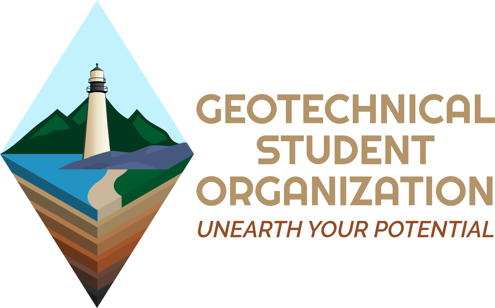
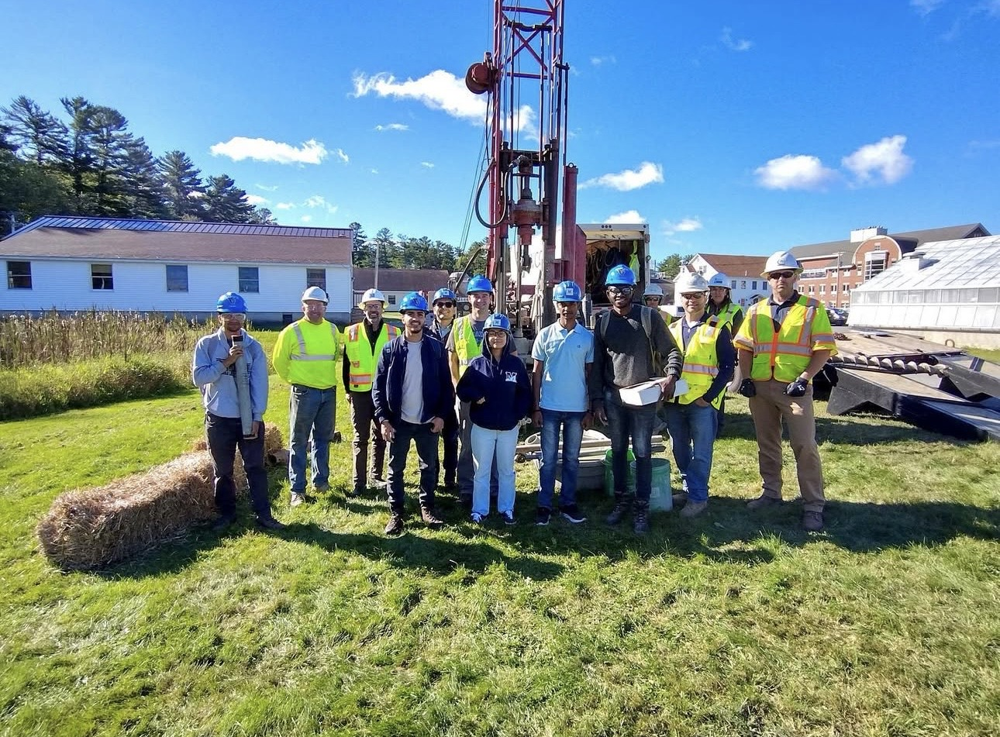

::: {.hero}

::: {.intro-band}
Welcome to Geotechnical Student Organization at The University Of Maine
:::

::: {.learn-btn-wrapper}
[Learn More](#about){.learn-btn}
:::

:::

::: {.about-split .about-margin-button #about}

  

  

  
About Us

  The Geotechnical Student Organization (GSO) is a student-run organization
  at the University of Maine for undergraduate and graduate students
  interested in geotechnical engineering.

  

:::

::: {.mission-split #mission}

  

  
Mission

  Our mission is to connect, support, and develop geotechnical engineering students through hands-on learning, professional engagement, and meaningful collaboration, preparing them to become skilled, innovative engineers who contribute to sustainable communities.

  

  

:::

::: {.vision-split .vision-margin-button #vision}

  

  

  
Vision

  Our vision is to be a leading student organization that connects geotechnical engineering students with academic and industry partners while providing opportunities for personal and professional growth, innovation, and excellence.

  

:::

::: {.goal-split #goal}

  

  
Goal

  Our goal is to promote meaningful interaction between students and leading academics, companies, institutes, and professional societies related to geotechnical engineering.

  

  

:::

::: {.grid}

::: {.tile}
<a href="members.qmd">
  
  
Who are we?

</a>
:::

::: {.tile}
<a href="resources.qmd">
  
  
Looking for workshop materials and presentations?

</a>
:::

::: {.tile}
<a href="events.qmd">
  
  
Want to know more about our upcoming events?

</a>
:::

::: {.tile}
<a href="gallery.qmd">
  
  
Take a look down memory lane!

</a>
:::

:::

<!-- ## About Us {#about .about-margin-button} -->

<!-- The Geotechnical Student Organization (GSO) is a student-run organization at the University of Maine for undergraduate and graduate students interested in geotechnical engineering. We focus on hands-on learning, professional development, and building a strong, supportive community. -->

<!-- GSO provides opportunities beyond the classroom through workshops, technical seminars, field experiences, and collaborative events. These activities help students connect theory with practice, learn new tools and methods, and gain exposure to real-world geotechnical applications. -->

<!-- We emphasize professional connection and community building by bringing together students, faculty, and industry professionals. Through collaborations with organizations such as COPRI and the Geo-Institute of ASCE, GSO supports student participation in conferences, workshops, and competitions while fostering an inclusive, low-pressure environment for learning and connection. -->

<!-- ## Mission {#mission} -->

<!-- Our mission is to provide a platform for geotechnical engineering students to connect, learn, and grow. We create a supportive environment that enhances academic and professional development through technical events, workshops, and networking opportunities that expose students to real-world challenges and solutions. We foster a culture of collaboration, innovation, and excellence that prepares members to be effective and impactful geotechnical engineers and to contribute to sustainable communities. -->

<!-- ## Vision {#vision} -->

<!-- To be a leading student organization that connects geotechnical engineering students with academic and industry partners while providing opportunities for personal and professional growth, innovation, and excellence. -->

<!-- ## Goals {#goals} -->

<!-- To promote meaningful interaction between students and leading academics, companies, institutes, and professional societies related to geotechnical engineering. -->
