## Join GSO

Joining the Geotechnical Student Organization (GSO) offers students an opportunity to extend their learning beyond the classroom and engage directly with the field of geotechnical engineering. GSO provides hands on workshops, technical seminars, field experiences, and collaborative events that help bridge the gap between theory and practice. Through these activities, members gain exposure to real world challenges, develop practical skills, and become more confident applying engineering concepts in professional settings.

GSO also creates a supportive and inclusive environment where students can build meaningful connections with peers, faculty, and industry professionals. By collaborating with organizations such as the Geo Institute of ASCE, COPRI, undergraduate organizations such as ASCE Student Chapter and Chi Epsilon, the Civil Engineering Honor Society, the organization supports participation in conferences, competitions, and professional development events. Whether you are an undergraduate exploring geotechnical engineering or a graduate or undergraduate student refining your expertise, GSO provides a platform to connect, learn, and grow while preparing to become an effective and impactful engineer.

## Presidency

::: {.member-grid}

::: {.member-card}

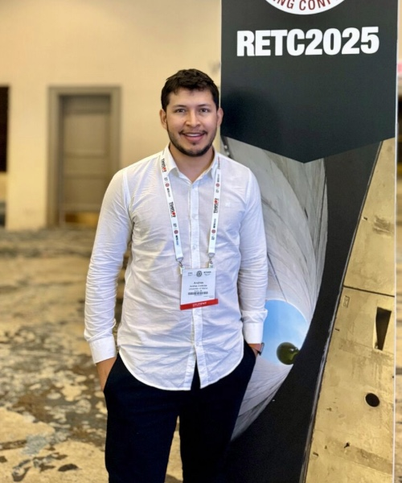{.andres-cordoba-photo}
::: {.member-info}
### Andres Cordoba Ordonez, MSc.
**President (Jul 2025–Present)**
:::
:::

::: {.member-card .alumni}

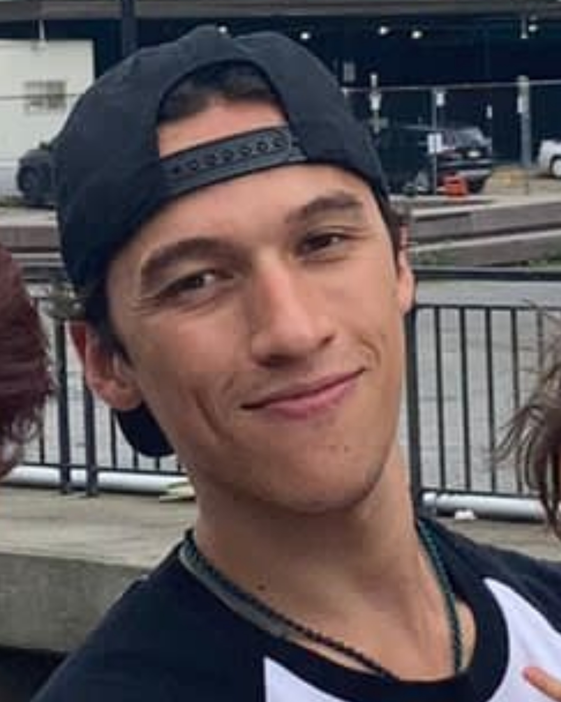{.sebastian-montoya-photo}
::: {.member-info}
### Sebastian Montoya Vargas, Ph.D., E.I.T
**Past President (Jan 2025–Jul 2025)**
:::
:::

::: {.member-card}

{.saba-cyr-photo}
::: {.member-info}
### Saba Cyr, BSc., E.I.T
**Past President (Jan 2023–Jan 2025)**
:::
:::

:::

## Executive Board

::: {.member-grid}

::: {.member-card}

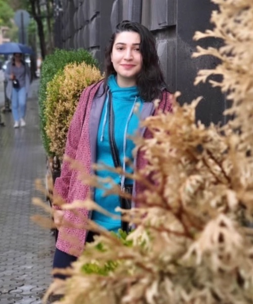{.zeynab-nazari-photo}
::: {.member-info}
### Zeynab Nazari, MSc.
**Vice President (Jul 2025–Present)**
:::
:::

::: {.member-card}

{.saba-cyr}
::: {.member-info}
### Saba Cyr, BSc., E.I.T
**Vice President (Jul 2025–Present)**
:::
:::

:::

## Members

::: {.member-grid}

::: {.member-card}

{.andres-cordoba-photo}
::: {.member-info}
### Andres Cordoba Ordonez, MSc.
**Ph.D. Student**
:::
:::

::: {.member-card}

{.zeynab-nazari-photo}
::: {.member-info}
### Zeynab Nazari, MSc.
**Ph.D. Student**
:::
:::

::: {.member-card}

{.saba-cyr}
::: {.member-info}
### Saba Cyr, BSc., E.I.T
**Ph.D. Candidate**
:::
:::

::: {.member-card}

{.johan-mira}
::: {.member-info}
### Johan Mira, BSc.
**MSc. Student**
:::
:::

::: {.member-card .alumni}

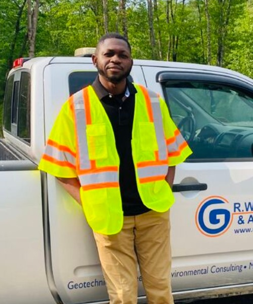{.temitope-omokinde-photo}
::: {.member-info}
### Temitope Omokinde, MSc., E.I.T
**Geotechnical Engineer**
:::
:::

::: {.member-card .alumni}

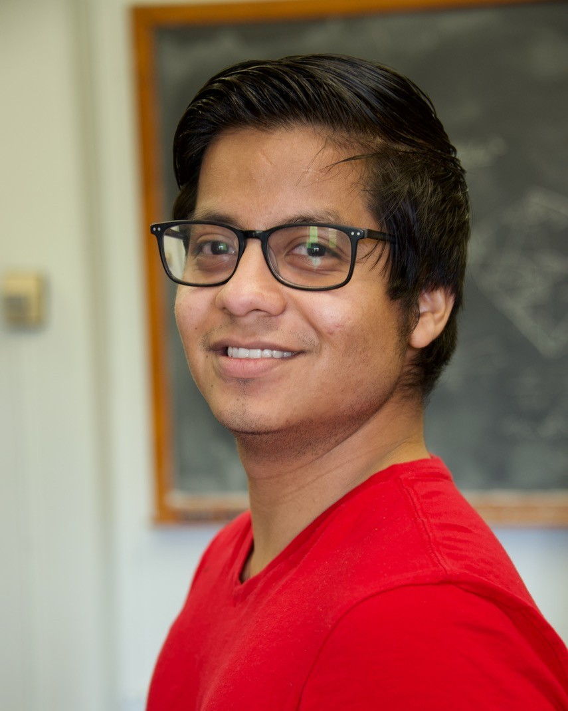{.anthony-flores-photo}
::: {.member-info}
### Anthony Flores, MSc., E.I.T
**Geotechnical Engineer**
:::
:::

::: {.member-card .alumni}

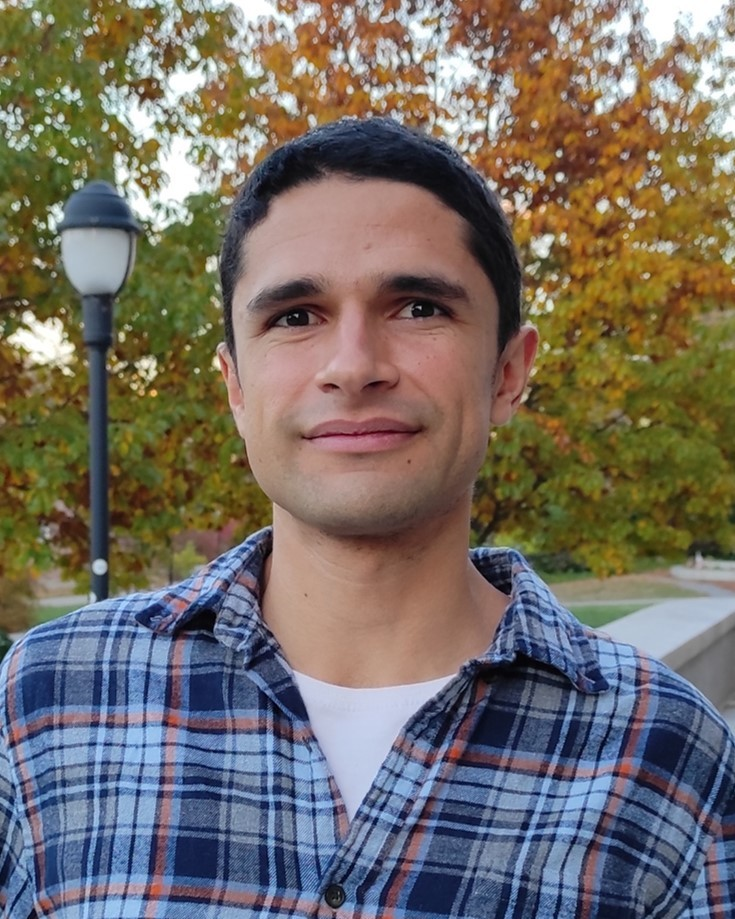{.danilo-botero-photo}
::: {.member-info}
### Danilo Botero Lopez, Ph.D., E.I.T
**Geotechnical Engineer**
:::
:::

::: {.member-card .alumni}

{.paula-sarmiento}
::: {.member-info}
### Paula Sarmiento Robles, BSc.
**Ph.D. Student**
:::
:::

::: {.member-card .alumni}

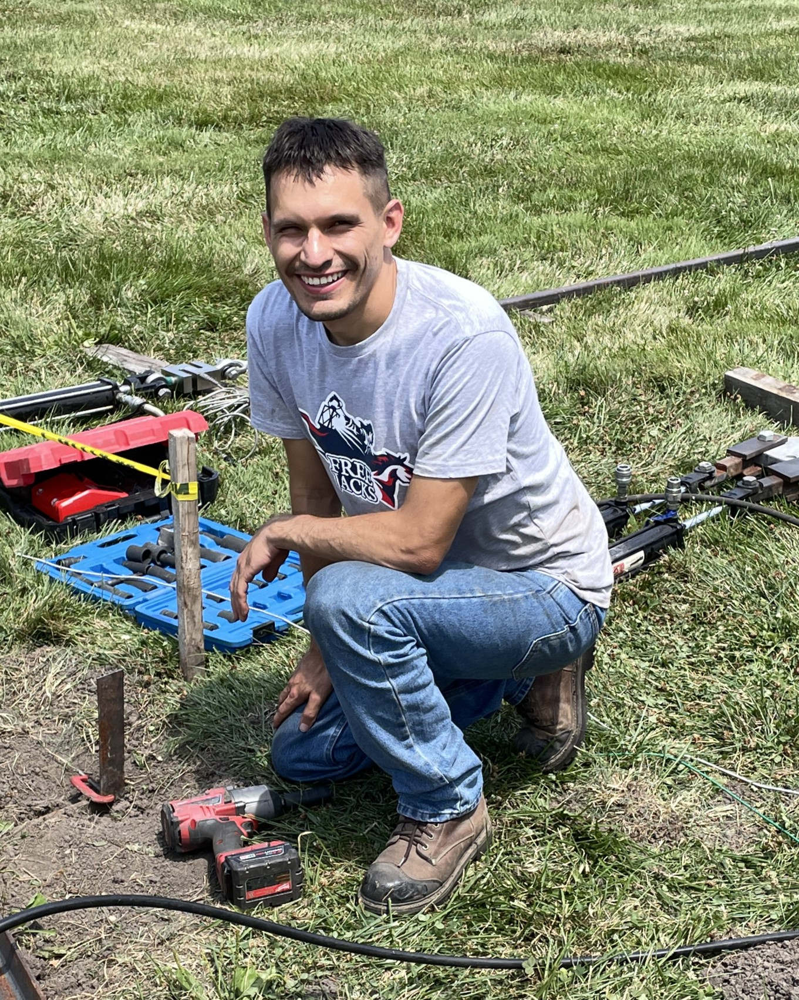{.sebastian-carvajal-photo}
::: {.member-info}
### Sebastian Carvajal, MSc., E.I.T
**Geotechnical Engineer**
:::
:::

::: {.member-card .alumni}

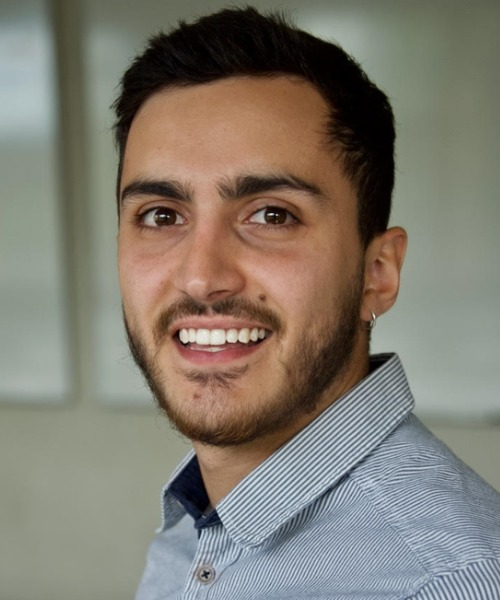{.andres-espinosa-photo}
::: {.member-info}
### Andres Espinosa, MSc., E.I.T
**Geotechnical Engineer**
:::
:::

::: {.member-card .alumni}

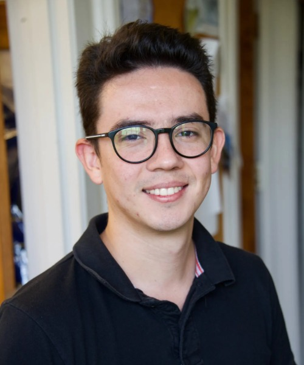{.camilo-fernandez-photo}
::: {.member-info}
### Camilo Fernandez, MSc., E.I.T
**Geotechnical Engineer**
:::
:::

::: {.member-card .alumni}

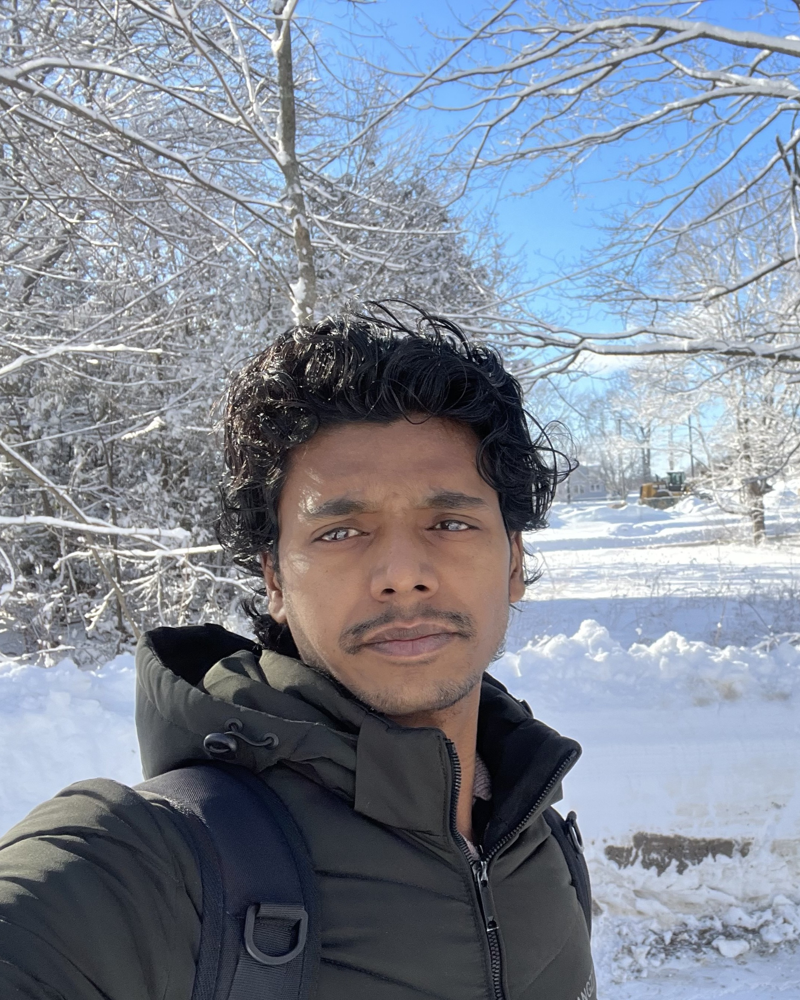{.rakesh-pandit-photo}
::: {.member-info}
### Rakesh Pandit, MSc., E.I.T
**Geotechnical Engineer**
:::
:::

::: {.member-card .alumni}

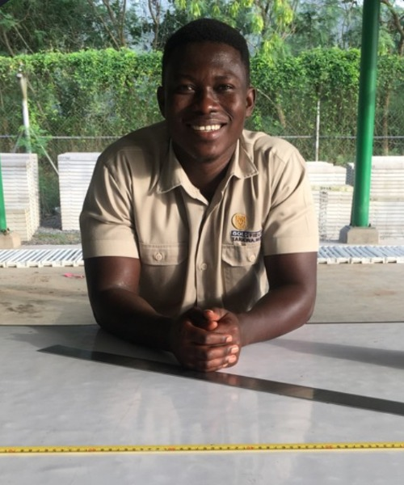{.abdul-aziz-photo}
::: {.member-info}
### Abdul Aziz Umar, MSc., E.I.T
**Geotechnical Engineer**
:::
:::

::: {.member-card .alumni}

{.peta-fifield-photo}
::: {.member-info}
### Peta Fifield, MSc., E.I.T
**Geotechnical Engineer**
:::
:::

::: {.member-card .alumni}

{.babak-mahmoudi-photo}
::: {.member-info}
### Babak Mahmoudi, Ph.D., E.I.T
**Geotechnical Engineer**
:::
:::

::: {.member-card .alumni}

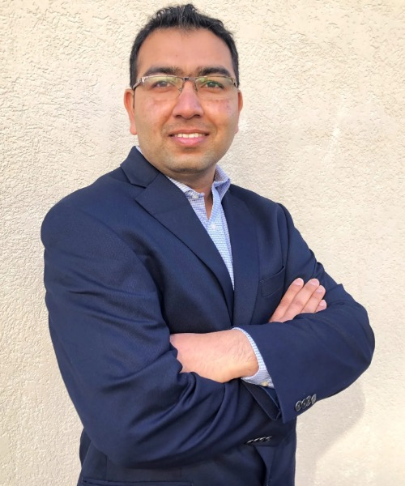{.belal-hossen-photo}
::: {.member-info}
### SK Belal Hossen, Ph.D., E.I.T
**Geotechnical Engineer**
:::
:::

:::

## Faculty

::: {.member-grid}

::: {.member-card}

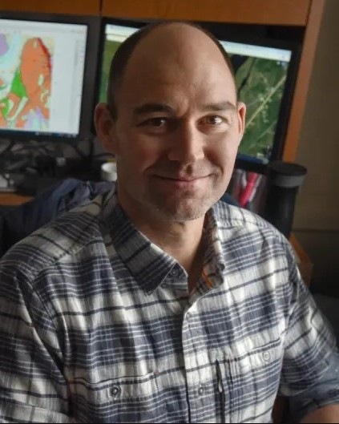{.aaron-gallant-photo}
::: {.member-info}
### Aaron Gallant, Ph.D., P.E.
**Associate Professor**
:::
:::

::: {.member-card .alumni}

{.luis-zambrano-photo}
::: {.member-info}
### Luis Zambrano Cruzatty, Ph.D., P.E.
**Former Assistant Professor**
:::
:::

:::
